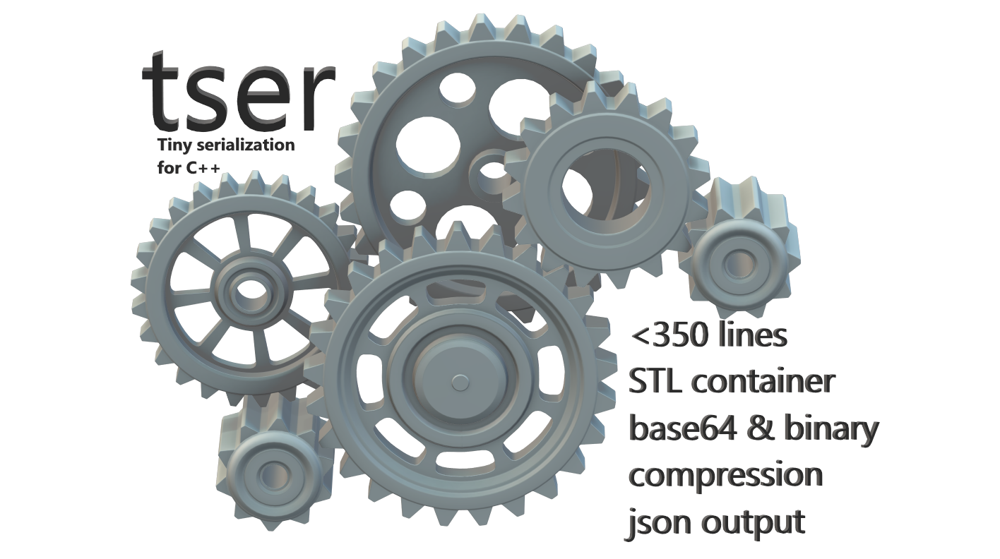

# tser - Tiny Serialization for C++
[](https://ci.appveyor.com/project/KinanMahdi/tser)
[](https://www.boost.org/LICENSE_1_0.txt)
[](https://godbolt.org/z/4jGoeP)
[](http://isitmaintained.com/project/konanM/tser "Average time to resolve an issue")
[](http://isitmaintained.com/project/konanM/tser "Percentage of issues still open")
## Why another C++ serialization library?

I searched for a small C++ serialization library (<16 KB) for some competitive programming contest and didn't find anything that suited my needs. 

I wanted a library that was small, but allowed me to avoid as much boilerplate as possible. Especially if you are quickly prototyping you want to avoid implementing serialization, printing and comparision operators manually.

**tldr:** be quicker to serialize your object, print it to the console, compare it and load it from a string than to figure out how other serialization libraries work. 

If you need a battle tested, non-intrusive and feature rich serialization libary, please have a look at [Boost](https://www.boost.org/doc/libs/1_72_0/libs/serialization/doc/index.html), [Cereal](https://uscilab.github.io/cereal/), [Bitsery](https://github.com/fraillt/bitsery), [Protobuf](https://developers.google.com/protocol-buffers), [Flatbuffers](https://google.github.io/flatbuffers/), [Yas](https://github.com/niXman/yas). If you need fast binary serialization have a look at [Cista](https://cista.rocks). They all provide a better feature set and better flexibility. Tser is meant to be tiny - copy one small header put a macro into a few places and be good to go. 

## Design goals
* serialization of nearly **all of the STL containers and types**, as well as custom containers that follow STL conventions
* implement pretty printing to the console **automatically**, but allow for user defined implementations
* implement comparision operators (equal, non-equal, smaller) **automatically**, but allow for user defined implementations
* support printing the serialized representation of an object to the console via base64 encoding (this way only printable characters are used, allows for easily loading objects into the debugger via strings)
* use minimal set of includes (```array, cstring, string, string_view, tuple, type_traits, ostream```) and only ~ 320 lines of code

## Features

* C++17 header only and single header (320 LOC, 292 LOC without comments - 13Kb)
* Cross compiler (supports gcc, clang, msvc) and warning free (W4, Wall, Wextra)
* Dependency-free
* Boost-License so feel free to do whatever you want with the code
* Supports ```std::array, std::vector, std::list, std::deque, std::string, std::unique_ptr, std::shared_ptr, std::optional, std::tuple, std::map, std::set, std::unordered_map, std::unordered_set, std::multiset, std::multimap, std::unordered_multimap, std::unordered_multiset ```
* Supports serialization of user defined types / containers
* Supports recursive parsing of types (e.g. containers/pointers of serializable types)
* Supports pretty printing to the console **in json format**
* Supports printing of the serialized representation via **base64 encoding**
* Supports **automatic compression** of integers via variable int encoding (see also [protobuf encoding](https://developers.google.com/protocol-buffers/docs/encoding))

## Basic Example [](https://godbolt.org/z/4jGoeP)

```cpp
#include <cassert>
#include <iostream>
#include <optional>
#include <tser/tser.hpp>

enum class Item : char { RADAR = 'R', TRAP = 'T', ORE = 'O' };

struct Point {
    DEFINE_SERIALIZABLE(Point,x,y)
    int x = 0, y = 0;
};

struct Robot {
    DEFINE_SERIALIZABLE(Robot,point,item)
    Point point;
    std::optional<Item> item;
};

int main()
{
    auto robot = Robot{ Point{3,4}, Item::RADAR };
    std::cout << robot << '\n'; // prints { "Robot": {"point" : { "Point": {"x" : 3, "y" : 4}}, "item" : "R"}}
    std::cout << Robot() << '\n'; // prints { "Robot": {"point" : { "Point": {"x" : 0, "y" : 0}}, "item" : {null}}}

    std::cout << tser::BinaryArchive(robot); //prints BggBUg to the console via base64 encoding (base64 means only printable characters are used)
    //this way it's quickly possible to log entire objects to the console or logfiles

    //due to varint encoding only 6 printable characters are needed, although the struct is 12 bytes in size
    //e.g. a size_t in the range of 0-127 will only take 1 byte (before the base 64 encoding)
}
```

## Test example
You can construct BinaryArchive from a base64 encoded string (which will be decoded automatically).
So it's basically one or two lines of code to load a complex object into a test and start using it.


Feel free to grab the [base64_encoding.hpp](https://github.com/KonanM/tser/blob/master/include/tser/base64_encoding.hpp) header to use it as standalone header in your projects.

```cpp
void test()
{
    //if we construct BinaryArchive with a string it will decode it and initialized it's internal buffer with it
    //alternatively you can use tser::load to directly load an object
    auto loadedRobot = tser::load<Robot>("BggBUg");

    auto robot = Robot{ Point{3,4}, Item::RADAR };
    //all the comparision operators are implemented, so I could directly use std::set<Robot>
    bool areEqual = (robot == loadedRobot) && !(robot != loadedRobot) && !(robot < loadedRobot);
    (void)areEqual;
    std::cout << loadedRobot; //prints { "Robot": {"point" : { "Point": {"x" : 3, "y" : 4}}, "item" : "R"} }
}
```

## How can I serialize something that has a base class?
There is a small utility function for this use case called ```tser::base<Base>(this)```.  It's a const correct version of ```((Base&)*this)``` (which you could also use, but it will probably produce a warning).
This only works if the base class also uses the tser macro.
```cpp
struct Object : public Point
{
    int idx = 0;
    DEFINE_SERIALIZABLE(Object, tser::base<Point>(this), idx)
};
```
If you have a base class which is not related to tser (or don't need to serialize the whole base class), you can alternatively just list the members of the base class directly.
```cpp
struct Object : public Point
{
    int idx = 0;
    DEFINE_SERIALIZABLE(Object, x, y, idx)
};
```
## Pretty printing example [](https://godbolt.org/z/r1414M)
Datastructures taken from [Cpp Serializer Benchmark](https://github.com/fraillt/cpp_serializers_benchmark/blob/master/testing_core/types.cpp)

```cpp
struct Vec3 {
    DEFINE_SERIALIZABLE(Vec3,x,y,z)
    float x, y, z;
};

struct Weapon {
    DEFINE_SERIALIZABLE(Weapon,name,damage)
    std::string name;
    int16_t damage;
};

struct Monster {
    DEFINE_SERIALIZABLE(Monster,pos,mana,hp,name,inventory,color,weapons,equipped,path)
    Vec3 pos;
    int16_t mana;
    int16_t hp;
    std::string name;
    std::vector<int> inventory;
    Color color;
    std::vector<Weapon> weapons;
    Weapon equipped;
    std::vector<Vec3> path;
};
//SEE EXEMPLE2.cpp
int main(){
    Monster randomMonster = createRandomMonster();
    std::cout << randomMonster;
}
```
The output will be in json format (which can be [prettyfied](https://jsonformatter.curiousconcept.com/)) and looks like this:
```yaml
{ "Monster": {"pos" : { "Vec3": {"x" : -0.763506, "y" : 0.293835, "z" : -0.840006}
}, "mana" : 378, "hp" : 857, "name" : "YIOEAM", "inventory" :
[8, 4, 1, 7, 1, 7, 5, 3, 3, 3]
, "color" : "Blue", "weapons" :
[  { "Weapon": {"name" : "TZJ", "damage" : 11753}
}, { "Weapon": {"name" : "VWX", "damage" : 16449}
}]
, "equipped" : { "Weapon": {"name" : "LYIJWP", "damage" : 8503}
}, "path" :
[  { "Vec3": {"x" : 0.1284, "y" : -0.233815, "z" : -0.253437}
}, { "Vec3": {"x" : 0.827373, "y" : -0.0843914, "z" : 0.452065}
}, { "Vec3": {"x" : -0.791171, "y" : 0.530956, "z" : -0.381805}
}]
}}
```

## Variable int encoding example

Integers are compressed via variable int encoding. The basic idea is to indicate (in the highest bit of a byte) if there are following bytes. The first seven bits of a byte are then used to store the lowest bits of the integer.
This way unsigned numbers from 0-127 only take 1 byte to store. Signed integers use zig-zag encoding so the range [-64,63] is encoded in one byte. See [protobuf encoding](https://developers.google.com/protocol-buffers/docs/encoding) for a more detailed explanation.


Feel free to grab the [varint_encoding.hpp](https://github.com/KonanM/tser/blob/master/include/tser/varint_encoding.hpp) header to use it as standalone header in your projects.
```cpp
int main()
{
    static constexpr size_t N = 5;
    size_t grid5x5[N][N]{};
    //fill the grid with some numbers
    for (size_t i = 0; i < N; ++i) {
        for (size_t j = 0; j < N; ++j) {
            grid5x5[i][j] = i * N + j;
        }
    }
    tser::BinaryArchive ba;
    ba.save(grid5x5);
    std::cout << ba; 
    //with compression (35 chars): AAECAwQFBgcICQoLDA0ODxAREhMUFRYXGA
    //wihtout compression (268 chars): 
    //AAAAAAAAAAABAAAAAAAAAAIAAAAAAAAAAwAAAAAAAAAEAAAAAAAAAAUAAAAAAAAABgAAAAAAAAAHAAAAAAAAAAg
    //AAAAAAAAACQAAAAAAAAAKAAAAAAAAAAsAAAAAAAAADAAAAAAAAAANAAAAAAAAAA4AAAAAAAAADwAAAAAAAAAQAA
    //AAAAAAABEAAAAAAAAAEgAAAAAAAAATAAAAAAAAABQAAAAAAAAAFQAAAAAAAAAWAAAAAAAAABcAAAAAAAAAGAAAAAAAAAA
}
```

## Custom load and save example
You can implement a custom load and save function for your type (e.g. memcpy everything) and you don't even need the ```DEFINE_SERIALIZABLE``` macro for it to work with the binary archive.
```cpp
struct CustomPointNoMacro {
    void save(tser::BinaryArchive& ba) const {
        ba.save(x + y);
    }
    void load(tser::BinaryArchive& ba) {
        x = ba.load<int>();
    }
    int x = 1, y = 2;
};
//alternatively you can also use a non intrusive version
namespace tser {
    static void operator<<(const CustomPointNoMacro& t, tser::BinaryArchive& ba) {
        ba.save(t.x + t.y);
    }
    static void operator>>(CustomPointNoMacro& t, tser::BinaryArchive& ba) {
        t.x = ba.load<int>();
    }
}

int main
{
    tser::BinaryArchive ba;
    ba.save(CustomPointNoMacro{ 5,6 });
    auto loadedPoint = ba.load<CustomPointNoMacro>();
    assert(loadedPoint.x == 11);//x was assigned 5+6 in the save method
    assert(loadedPoint.y == 2); //y was default intialized to 2
}
```

## Loading/saving binary contents from/to a file without base64 encoding
Tser is designed around the main use case of working directly with base64 encoded (human readable and console prinatable) characters. If you want to store the contents in a non base64 encoded binary format (to save some space), this is also possible, but not as convenient.
```cpp
// save binary to disk
tser::BinaryArchive archive;
archive.save(Robot{ Point{3,4}, Item::RADAR });
std::string_view archive_view = archive.get_buffer(); // <-- *NOT* base64 encoded
std::ofstream("example.txt", std::ios::binary).write(archive_view.data(), archive_view.size());
```

```cpp
// load (*NOT* base64 encoded) binary from disk
std::string s;
std::ofstream("example.txt", std::ios::binary) >> s;
tser::BinaryArchive archive(0); //here we can't use the constructor that takes a string, since that expects base64 encoded data
archive.initialize(s); //we have to use the initialize method to feed the binary data into the BinaryArchive

auto robot = archive.load<Robot>();
```

## Custom comparision functions example
The ```DEFINE_SERIALIZABLE``` macro detects custom comparision functions and will only implement the (```==,!=,<```) comprisions functions that aren't defined (```!=``` is defined in terms of the equality operator ```!(lhs == rhs)```)
```cpp
struct Vec3 {
    DEFINE_SERIALIZABLE(Vec3,x,y,z)
    float x, y, z;
    friend bool operator==(const Vec3& lhs, const Vec3& rhs){
        static constexpr float eps = 1e-6f;
        return std::abs(lhs.x - rhs.x) < eps && std::abs(lhs.y - rhs.y) < eps && std::abs(lhs.y - rhs.y) < eps;
    }
};
```

## How do pointers bevave for serialization?
**tldr:** pointers behave like std::optional. When they are not nullptr the pointed to object is serialized.
```cpp
struct PointerWrapper
{
    DEFINE_SERIALIZABLE(PointerWrapper,intPtr,unique,shared)
    ~PointerWrapper(){delete intPtr};
    int* intPtr = nullptr;
    std::unique_ptr<Point> unique;
    std::shared_ptr<Point> shared;
};

int main()
{
    BinaryArchive binaryArchive;
    PointerWrapper smartWrapper{new int(5), std::unique_ptr<Point>(new Point{1,2}), std::shared_ptr<Point>(new Point{1,2}) };
    //the content of a raw pointer is serialized, not the address
    binaryArchive.save(&smartWrapper);
    //the serialized layout of shared_ptr<T>, unique_ptr<T>, optional<T> and T* are all the same
    //so if I really wanted to I could load T* as optional
    auto loadedSmartWrapper =  binaryArchive.load<std::optional<PointerWrapper>>();
}
```

## Can I print differences between classes of the same type?
For now it is a feature that I'm not sure if I should make it part of the main library. You can find it here [print_diff.hpp](https://github.com/KonanM/tser/tree/master/test/print_diff.hpp).
It ```tser::print_diff(o1,o2);``` only prints the differing parts of the objects, it would be good if I could get some feedback if this should be improved. 


## How does it work?

Internally the macro exposes a tuple of the members and the name of the members. It would also be possible to implement this manually for every type.

```cpp
struct Point {
    int x = 0, y = 0;
    //DEFINE_SERIALIZABLE(Point,x,y) expands to:
    constexpr inline decltype(auto) members() const { return std::tie(x, y); }
    constexpr inline decltype(auto) members()       { return std::tie(x, y); }
    static constexpr std::string_view _typeName{"Point"};
    static constexpr std::array<std::string_view, 2> _memberNames{"x", "y"};
};
```
By providing a function ```members()``` to iterate over the members we can now use if constexpr in combination with the detection idiom to detect how each member should be serialized.
The printing of types is realized with the static ```_memberNames``` field.

## Integration
tser.hpp is the single required file in the folder single_header/tser. Add the folder folder as include directory or copy it into one of your include directories.
If you really just want to use tser for single file rapid prototyping it's also small enough to just copy the contents of the file tser.hpp on top of the file your working on.

```#include <tser/tser.hpp>```

If you are using CMake >= 3.11 you can also use FetchContent to download and use tser directly. 
```c++
FetchContent_Declare(
  tser
  GIT_REPOSITORY https://github.com/KonanM/tser.git
  GIT_TAG        v1.2
)
FetchContent_MakeAvailable(tser)
target_link_libraries(mylib PRIVATE KonanM::tser)
```

## Limitations
* Only supports default constructible types
* Is intrusive and uses a single macro to be able to reflect over members of a given type
* No safety checks, no versioning, types need the same binary layout on different platforms
* No support for ```std::variant``` (unless trivially copyable)
* No support for ```std::stack, std::priority_queue, std::string_view```
* Needs a recent compiler

## Compiler support
See also https://godbolt.org/z/8f6z3T
* MSVC >= 19.22
* Clang >= 9.0
* Gcc >= 7.3

## Licensed under the [Boost License](LICENSE)
